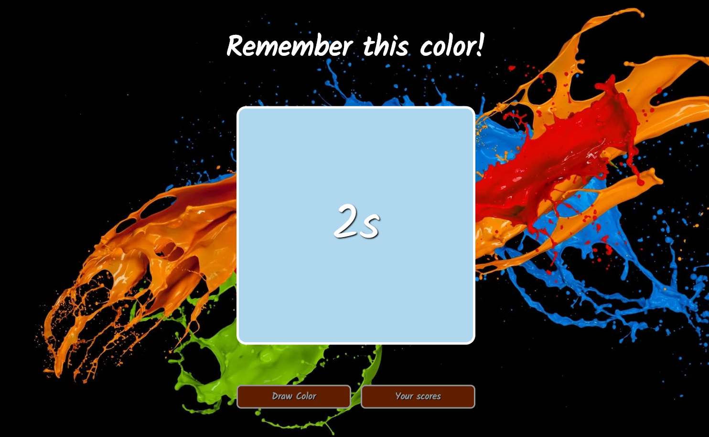

# ColorGame



 [Click and check it!](https://maciejspalek.github.io/ColorGame/)

 ## About the project
The game consists in storing previously drawn color and setting it by sliders. The developed algorithm compares the values of the R, G, B coordinates of two colors and displays the result in percents.


 ## Main algorithm

```javascript
function compareColors() {
    const rmean = (drawRed+checkRed)/2;
    const r = drawRed-checkRed
    const g = drawGreen-checkGreen;
    const b = drawBlue-checkBlue;
    const weightR = 2 + rmean/256;
    const weightG = 4.0;
    const weightB = 2 + (255-rmean)/256;
    const d1 =  Math.sqrt(weightR*r*r + weightG*g*g + weightB*b*b);
    const maxColDist = 764.8339663572415;
    const s1 = Math.round(((maxColDist-d1)/maxColDist)*100) + "%";
    currentPercent = s1;
    $('.result-text').text(s1);
}
```
 ## The project created with
 * HTML
 * BEM
 * CSS + SASS
 * JS + jQuery
 * Responsive Web Design

## Usage

```
npm start
```